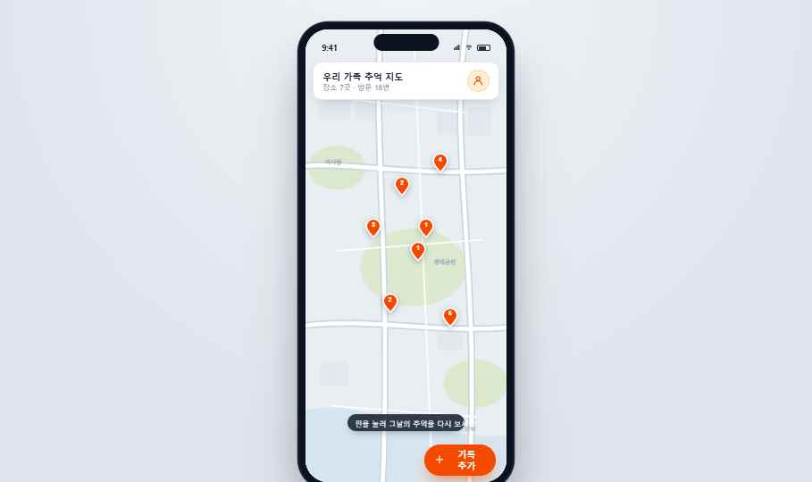
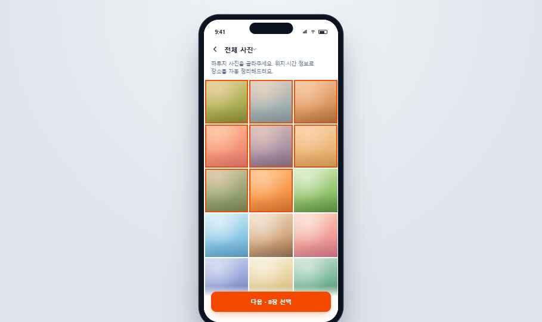
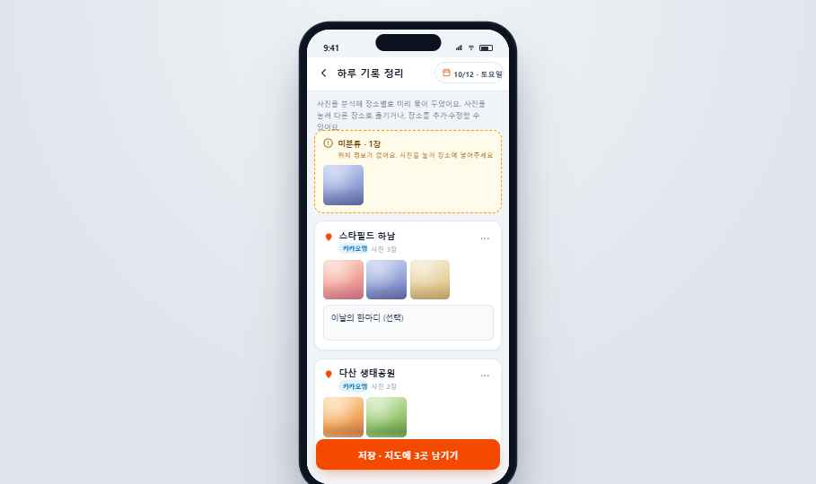
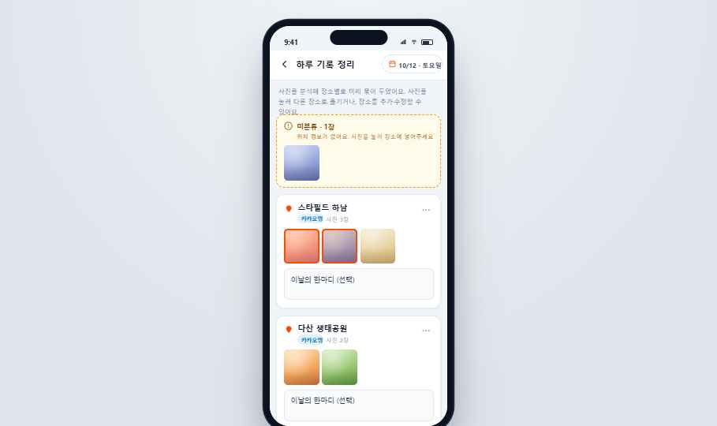
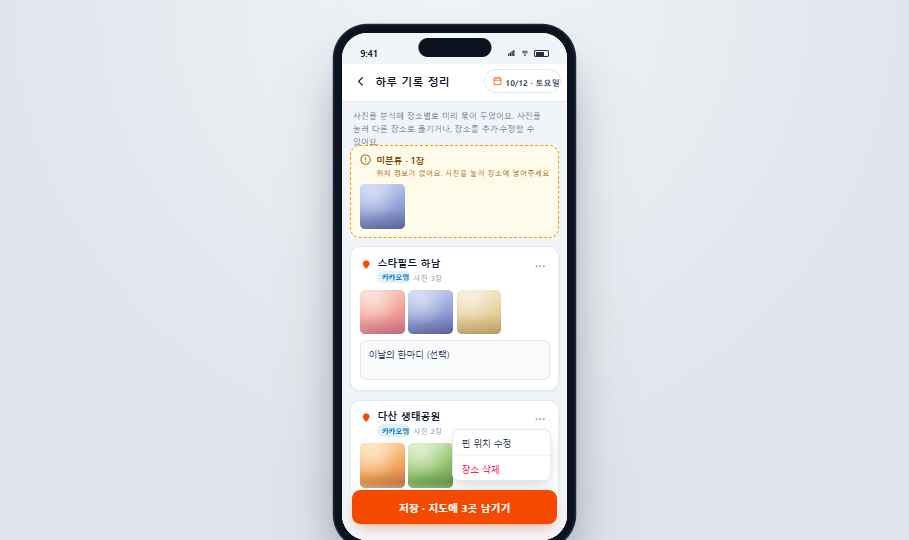
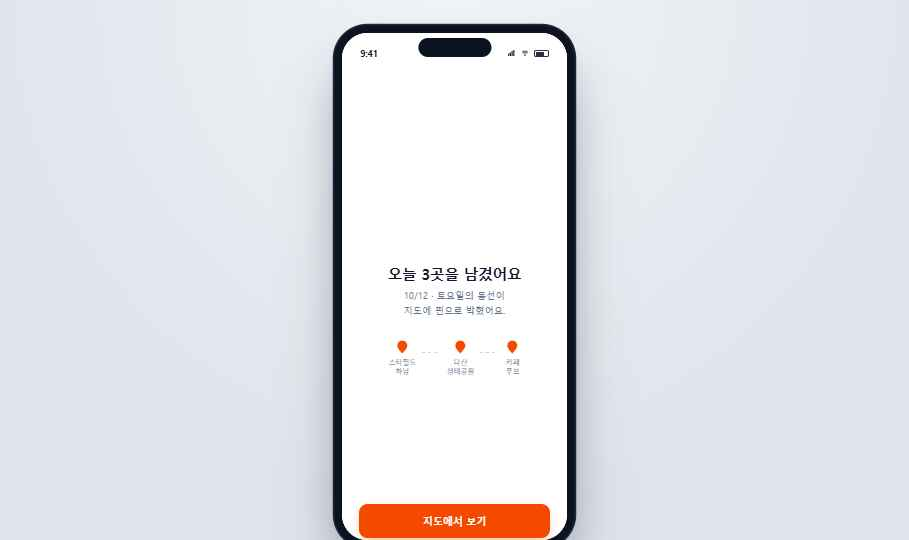
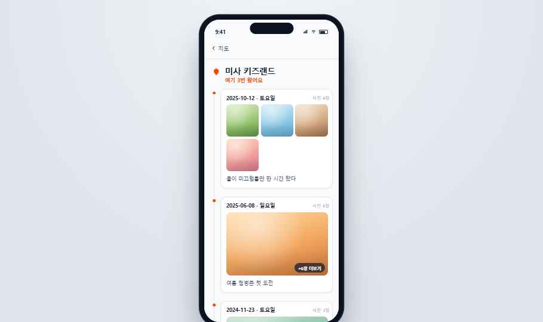
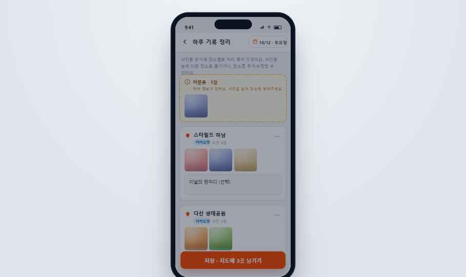
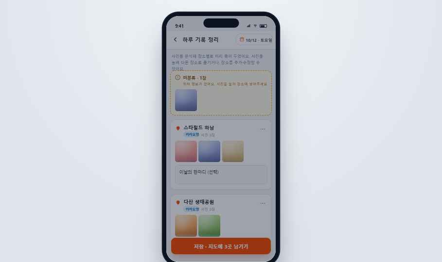
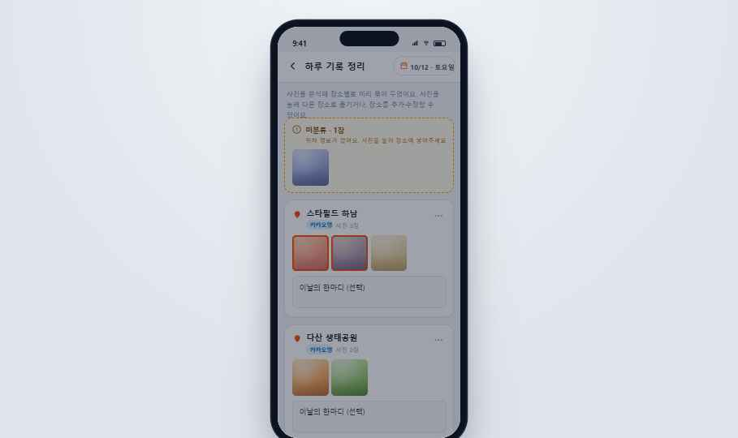

# Handoff: dear-baby V2 — 추억 지도 (Memory Map) MVP

> 1인 풀스택(Vercel + Supabase) 개발용 디자인 핸드오프. Claude Code / Cursor로 구현 착수.

---

## Overview

**dear-baby V2**는 아이와 다녀온 장소를 날짜·사진과 함께 **지도에 핀으로 기록**하고, 시간이 쌓이면 그 지도를 다시 열어 **되새기는** 모바일 웹 앱이다. 핵심 루프는 둘:

1. **기록하기** — 갤러리에서 하루치 사진을 골라 올리면, EXIF(GPS·촬영시각)로 장소별 자동 그룹핑 → 사용자가 가볍게 확인·수정 → 저장하면 지도에 핀이 박힌다. (30초~2분 목표)
2. **되새기기** — 핀이 가득한 지도를 열어 "우리 이만큼 다녔구나"를 느끼고, 핀을 눌러 그 장소의 모든 방문을 시간순으로 본다.

전체 제품 맥락·성공지표·데이터모델·범위는 함께 번들된 **`dear-baby-v2-prd.md`** 에 있다. 이 README는 그 PRD의 §6(화면 흐름)·§7(디자인 방향)을 **구현 가능한 수준으로 구체화**한 디자인 명세다.

---

## About the Design Files

이 번들의 `dear-baby-v2-prototype.dc.html`는 **HTML로 만든 디자인 레퍼런스**다 — 의도한 모양과 동작을 보여주는 인터랙티브 프로토타입이지, 그대로 가져다 쓰는 프로덕션 코드가 아니다.

- `.dc.html` 파일은 사내 디자인툴 전용 런타임(`support.js`)에서 도는 컴포넌트 포맷이다. **로직(`renderVals`, 상태머신)과 마크업·인라인스타일을 읽어 의도를 파악하는 용도**로만 쓴다.
- 실제 작업은 이 디자인을 **타깃 스택(Vercel + Next.js/React + Supabase)에서 그 환경의 패턴·라이브러리로 재구현**하는 것이다. 인라인 스타일을 그대로 베끼지 말고, Tailwind/CSS Modules 등 프로젝트가 채택한 방식으로 옮긴다.
- 프로토타입의 지도는 **SVG로 그린 가짜 지도**다. 실제 구현은 **카카오맵 JavaScript SDK** 위에 핀을 얹는다(PRD §8). EXIF 분석·역지오코딩·로그인·이미지 업로드는 전부 목(mock)이다 — 동작 명세는 본 문서 "Interactions & Behavior" 참조.

`support.js`는 프로토타입을 브라우저에서 열어보기 위해 포함했다. 구현에는 불필요하다.

---

## Fidelity

**High-fidelity (hifi).** 색상·타이포·간격·반경·그림자·인터랙션이 모두 확정값이다. UI는 이 명세대로 픽셀에 가깝게 재현하되, 스타일 적용 방식만 코드베이스 관례를 따른다. 단, 위에 적었듯 **지도/EXIF/로그인/업로드는 실제 SDK·API로 대체**한다.

**모바일 우선.** 모든 화면은 **390 × 844px (iPhone 13/14 논리해상도)** 기준으로 설계됐다. 데스크톱은 후순위(PRD §7) — 중앙 정렬된 모바일 뷰포트로 두면 충분하다.

> 각 화면 캡처는 `screenshots/` 폴더에 있고, 아래 화면별 섹션에 인라인으로 첨부했다. (캡처는 폰 프레임째 담았고, 폰 베젤·노치는 프로토타입 표현일 뿐 구현 대상이 아니다.)

---

## Design Tokens

> 프로토타입은 톤을 정확히 잡으려고 OKLCH로 색을 적은 곳이 많다. 아래에 OKLCH ↔ 근사 HEX를 같이 표기한다. 구현 시 둘 중 편한 쪽을 쓰되 **primary 계열은 OKLCH 권장**(채도가 더 곱게 나온다).

### Color — Primary (tangerine, 유일한 "강조" 색)
| 역할 | OKLCH | ≈ HEX | 쓰임 |
|---|---|---|---|
| primary (기본) | `oklch(64.6% 0.222 41.116)` | `#EA5A1C` | 모든 CTA 버튼, 핀, 선택 강조, 액티브 |
| primary (밝은 변형) | `oklch(70.5% 0.213 47.604)` | `#FA7A3D` | 선택 오버레이/링 펄스 배경 |
| primary (진한 텍스트) | `oklch(55.3% 0.195 38.402)` | `#C2470F` | 아이콘/링크 텍스트 강조 |
| primary-50 (틴트 배경) | `oklch(95.4% 0.038 75.164)` | `#FCEEDD` | 아이콘 칩 배경 |
| primary-100 (틴트 보더) | `oklch(90.1% 0.076 70.697)` | `#F8D9BC` | 아이콘 칩 보더 |

### Color — Neutrals (slate)
| 토큰 | HEX | 쓰임 |
|---|---|---|
| ink / 제목 | `#0F172A` | 헤드라인, 본문 강조, 다크 바 배경 |
| body | `#334155` | 본문·인풋 텍스트 |
| muted | `#475569` / `#64748B` | 보조 텍스트·캡션 |
| faint | `#94A3B8` | 플레이스홀더·메타 |
| border | `#E2E8F0` | 카드/인풋/구분선 (1px) |
| border-strong | `#CBD5E1` | 점선 보더, 시트 핸들 |
| surface-subtle | `#F1F5F9` / `#F8FAFC` | 페이지/인풋 배경 |
| surface | `#FFFFFF` | 카드·시트·화면 배경 |

### Color — 지도(SVG 목업) & 상태
| 용도 | HEX |
|---|---|
| 지도 바탕 | `#E9EEF3` / `#EAEEF3` |
| 물 (강) | `#D6E6EF` |
| 녹지 | `#DDE9CF` / `#DBE8CD` |
| 도로 외곽 / 안쪽 | `#CDD5DF` / `#FFFFFF` |
| 건물 블록 | `#E3E8EE` |
| 지명 텍스트 | `#9AA6B4` |
| success (저장완료) | bg `oklch(95% 0.05 162)` ≈ `#E6F7EE`, icon `oklch(60% 0.16 162)` ≈ `#16A34A`, border `oklch(88% 0.08 162)` ≈ `#BBE9CF` |
| warning (미분류) | bg `oklch(98.7% 0.022 95.277)` ≈ `#FEFCE8`, border `oklch(76.9% 0.188 70.08)` ≈ `#E8A23D`, text `oklch(47% 0.1 67)` ≈ `#7A5A12` |
| danger (삭제) | `oklch(64.5% 0.246 16.439)` ≈ `#E5484D` |
| info 칩 (카카오 출처) | bg `oklch(95.1% 0.026 236.824)` ≈ `#E6F1FB`, text `oklch(50% 0.134 242.749)` ≈ `#1F6FB8` |
| 카카오 노랑 | `#FEE500` / 텍스트 `#191600` |

### Typography
- **Font:** `Pretendard` (한글·라틴 공용). CDN: `https://cdn.jsdelivr.net/gh/orioncactus/pretendard@v1.3.9/dist/web/static/pretendard.css`. 코드베이스에선 `pretendard` npm 패키지 또는 self-host 권장.
- **Weights used:** 400 / 500 / 600 / 700 / 800. (300·900 미사용)
- **헤드라인:** 24–27px / 800 / `letter-spacing:-0.025em` / line-height 1.3~1.32
- **섹션 타이틀:** 16–18px / 700
- **본문:** 15–16px / 400 / line-height 1.6~1.7
- **보조·캡션:** 12–13px / 400~600
- **숫자(통계·날짜·좌표):** `font-variant-numeric: tabular-nums`
- 전역: `word-break: keep-all` (한글 줄바꿈 자연스럽게)

### Radius
| 토큰 | px | 쓰임 |
|---|---|---|
| sm | 8 | 사진 타일, 작은 버튼 |
| md | 10–12 | 인풋, 검색창, 보조 버튼 |
| lg | 14 | 주요 CTA 버튼 |
| xl | 16 | 카드, 알림, 메뉴 |
| sheet | 20 (상단만) | 바텀시트 (`20px 20px 0 0`) |
| pill | 999 | 칩, FAB, 핀 카운트, 토스트 |
| phone | 41 (내부) / 54 (외곽) | 폰 프레임 (프로토타입 전용 — 구현 불필요) |

### Shadow
| 용도 | 값 |
|---|---|
| 카드 | `0 1px 3px rgba(15,23,42,0.05)` |
| 떠있는 상단 카드 | `0 8px 24px -10px rgba(15,23,42,0.28)` |
| 메뉴/팝오버 | `0 10px 24px -6px rgba(15,23,42,0.22)` |
| CTA 버튼(주황) | `0 10px 22px -8px oklch(64.6% 0.222 41.116 / 0.5)` |
| FAB | `0 14px 28px -8px oklch(64.6% 0.222 41.116 / 0.6)` |
| 핀 drop-shadow | `drop-shadow(0 4px 5px rgba(15,23,42,0.28))` |

### Spacing
4px 그리드. 화면 좌우 패딩 주로 16~28px, 카드 내부 14px, 그리드 gap 3~6px(사진), 14px(카드 간).

### Motion
- 시트 등장 `db-sheet`: `translateY(100%)→0`, 0.25s ease
- 선택바 등장 `db-up`: `translateY(12px)+fade`, 0.2s ease
- 핀 신규 펄스 `db-ring`: scale 0.55→2.5 + fade, 1.7s ease-out infinite
- 체크 팝 `db-pop`: scale 0→1.2→1, 0.2~0.4s (저장완료는 `cubic-bezier(0.16,1,0.3,1)`)
- 스켈레톤 `db-shimmer`: opacity 0.55↔1, 1.2s, 카드마다 0.2s stagger
- 분석 스피너 `db-spin`: rotate 360°, 0.8s linear infinite
- **press 상태 없음, hover 전환은 1단계 색변화만**(디자인시스템 원칙). bounce·scale-on-press 금지.

---

## Screens / Views

상태 변수 `screen` 하나로 전환되는 7개 화면 + 3개 바텀시트. 프로토타입 하단 "프로토타입 내비게이션" 칩은 데모용이며 **구현 대상 아님**.

### 1. C-1 · 빈 지도 온보딩 (`onboarding`)

- **목적:** 핀 0개인 첫 사용자에게 첫 기록을 유도(계곡 입구). 마찰 최소화.
- **레이아웃:** 풀스크린. 상단 2/3은 **SVG 빈 지도**(도로·강·녹지 + 미래 핀 자리를 나타내는 점선 원 5개, `#B6C0CD`~`#CCD4DE`, 2px dashed). 하단은 `linear-gradient`로 지도를 페이드시킨 카드 영역(`padding:40px 26px 52px`).
- **컴포넌트:**
  - 아이콘 칩: 60×60, radius 18, primary-50 배경 + primary-100 보더, 안에 map-pin 아이콘(stroke primary, 1.9).
  - H1 "아직 핀이 하나도\n없는 지도예요" (27px/800/-0.025em/#0F172A).
  - 본문 "아이와 다녀온 첫 장소를 남겨보세요.\n이 빈 지도가 우리 가족의 추억으로\n천천히 채워질 거예요." (16px/#475569/1.7).
  - CTA "첫 기록 남기기" (full width, h54, radius14, primary, 흰 텍스트, 버튼 그림자).
  - 힌트 행: 작은 image 아이콘 + "사진을 고르면 장소가 자동으로 정리돼요" (13px/#94A3B8).
- **핵심:** "빈약함"이 아니라 "채워가는 여백"으로 보이게 — 점선 미래핀 + 따뜻한 카피(PRD §7 핵심 과제).

### 2. A-1 / B-1 · 지도 홈 (`map`)

- **목적:** 진입점이자 되새김의 메인 무대. 핀 박힌 전체 지도.
- **레이아웃:** 풀스크린 SVG 지도. 핀은 `position:absolute; left/top:%` 로 배치(실제 구현은 카카오맵 마커).
- **컴포넌트:**
  - **상단 떠있는 카드:** `top:58px; left/right:14px`, 흰 배경 radius16 border, 떠있는 그림자. 좌측 "우리 가족 추억 지도"(16/700) + "장소 N곳 · 방문 N번"(13/#64748B/tabular-nums). 우측 40px 원형 아바타(primary-50 배경, user 아이콘).
  - **핀:** map-pin SVG 44px, fill primary, stroke 흰 1.5, drop-shadow. 핀 중앙 위쪽에 방문 횟수 숫자(12/700/흰/tabular-nums). 신규 저장 직후 핀은 뒤에 **펄스 링**(`db-ring`) — 3초 후 사라짐.
  - **힌트 알약:** `bottom:118px` 중앙, 다크 반투명 `rgba(15,23,42,0.84)`, "핀을 눌러 그날의 추억을 다시 보세요"(13/흰).
  - **FAB "기록 추가":** `bottom:38px; right:20px`, h56 pill, primary, + 아이콘 + 텍스트, FAB 그림자.
- **인터랙션:** 핀 탭 → 장소 상세(B-2). FAB 탭 → 사진 선택(A-2).

### 3. A-2 · 사진 선택 (`select`)

- **목적:** 갤러리에서 하루치 다중 선택.
- **레이아웃:** 흰 배경. 상단 헤더(뒤로 + "전체 사진" + chevron, 앨범 전환 암시) → 안내문 → **3열 그리드**(`gap:3px`, `aspect-ratio:1`) → 하단 고정 CTA(상단 흰 그라데이션 페이드).
- **컴포넌트:**
  - 안내문 "하루치 사진을 골라주세요. 위치·시간 정보로 장소를 자동 정리해드려요." (14/#64748B).
  - 사진 타일: 프로토타입은 그라데이션으로 사진을 대체(아래 "Assets" 참조). 선택 시 — primary 22% 오버레이 + `inset 0 0 0 3px primary` 보더 + 우상단 22px 원형 체크 배지(`db-pop` 등장).
  - CTA: 선택 N장이면 "다음 · N장 선택", 0장이면 "사진 없이 장소만 추가"(F-5 샛길). 항상 활성.
- **상태:** 프로토타입 초기값은 15장 중 앞 8장 선택. 실구현은 OS 사진 피커 또는 `<input type=file multiple accept=image/*>`.

### 4. 로그인 (`login`)

- **목적:** 첫 기록 시도 시점에만 인증(F-8). A-2 → A-3 사이, 미로그인 시 끼어듦.
- **레이아웃:** 흰 배경, 세로 중앙 정렬. 뒤로 버튼 → (중앙) 아이콘 칩 + 카피 + 소셜 버튼 3개 → (하단) 약관 문구.
- **컴포넌트:**
  - 아이콘 칩: 60×60 radius18 primary-50, heart 아이콘.
  - H1 "추억을 저장하려면\n로그인해주세요"(25/800). 본문 "방금 고른 사진과 편집한 내용은\n로그인 후에도 그대로 보관돼요."(15/#64748B) — **F-8 핵심: 로그인 전 입력 보존**.
  - 카카오 버튼: h52 radius12, `#FEE500` 배경 `#191600` 텍스트, 말풍선 아이콘.
  - 구글 버튼: h52 흰 배경 border, 구글 4색 그라데이션 원 + "Google로 계속하기".
  - 이메일 버튼: h52 흰 border, "이메일로 계속하기"(14/500/#64748B).
  - 약관: 12/#94A3B8 중앙.
- **인터랙션:** 어느 버튼이든 → 로그인 처리 → 곧장 편집기(A-3) 진입. 프로토타입은 모두 즉시 성공 목.

### 5. A-3 · 하루치 편집기 (`editor`) ★ 가장 중요한 화면
분석중 → 본문 → 사진 선택바 → 장소 메뉴 순서:

| 분석중 | 본문(미분류+장소그룹) | 사진 선택바 | 장소 ⋯ 메뉴 |
|---|---|---|---|
|  |  |  |  |

- **목적:** 자동 분석 결과 위에서 장소·사진을 편집하고 저장. **지친 부모가 30초~1분에 끝낼 것**(PRD §6.3).
- **레이아웃:** `#F1F5F9` 배경. 고정 헤더(흰) → (분석중이면 스켈레톤) → 본문 스크롤 → 하단 고정 저장바/선택바.
- **헤더:** 뒤로 + "하루 기록 정리"(18/700) + 우측 **날짜 칩**(달력 아이콘 + "10/12 · 토요일", pill border). 날짜 칩 탭 → 날짜 시트.
- **분석중 상태(`analyzing`, ~1.1s):** 스피너 + "사진 속 위치·시간을 분석하고 있어요…" + 118px 스켈레톤 카드 3개(shimmer, stagger). 실구현은 EXIF 파싱 + 역지오코딩 소요시간.
- **본문:**
  - 인트로 문구(사진 유무로 분기): 사진 있음 → "사진을 분석해 장소별로 미리 묶어 두었어요. 사진을 눌러 다른 장소로 옮기거나, 장소를 추가·수정할 수 있어요." / 사진 없음(F-5) → "사진 없이 장소만 남길 수 있어요. 아래 "장소 추가"에서 지도를 검색해 장소를 더하세요."
  - **미분류 카드(`hasUnassigned`):** warning 색 점선 카드. "미분류 · N장" + "위치 정보가 없어요. 사진을 눌러 장소에 넣어주세요" + 4열 사진 그리드. (F-3 — 위치 없는 사진을 **메인 흐름의 일부**로, 동등한 무게로.)
  - **장소 그룹 카드(반복):** map-pin 아이콘 + **장소명 인풋**(인라인 편집, 16/700) + 출처 칩("카카오맵" info색 / "직접 추가" 회색) + "사진 N장" + ⋯ 메뉴 버튼. 본문에 4열 사진 그리드. 하단에 멘트 textarea("이날의 한마디 (선택)", #F8FAFC 배경).
    - ⋯ 메뉴: "핀 위치 수정" / "장소 삭제"(danger). (절대배치 팝오버, radius12 그림자.)
  - **장소 추가 버튼:** 점선 border 카드, "장소 추가 · 지도에서 검색" → 장소 추가 시트.
- **하단 바(둘 중 하나):**
  - 사진 선택 중(`hasSelection`): 다크 바 `#0F172A`. "N장 선택됨" + [빼기](outline) + [장소로 이동](primary) + ✕. (`db-up` 등장.)
  - 평상시(`showSaveBar`): 흰 페이드 + CTA "저장 · 지도에 N곳 남기기"(primary).
- **사진 인터랙션(핵심):** 사진 탭 → 선택 토글(primary 보더+오버레이). 선택된 사진 → "장소로 이동"(이동 시트: 기존 장소 목록 + "새 장소 만들기") 또는 "빼기"(미분류로). **저장이 빈 칸이 아니라 이미 채워진 상태에서 시작 — 자동채우기와 수동편집은 하나의 편집기**(PRD §6.3 설계 원칙).

### 6. A-4 · 저장 완료 (`saved`)

- **목적:** 저장 직후 즉각적 되새김 씨앗. 방금 박은 핀을 보여줌.
- **레이아웃:** 흰 배경 중앙 정렬. 80px success 원형 체크(`db-pop` 등장) → H1 "오늘 N곳을 남겼어요"(24/800) → 본문 "{날짜}의 동선이\n지도에 핀으로 박혔어요." → **동선 미리보기**(핀들을 점선으로 연결, 각 핀 아래 장소명) → 하단 CTA "지도에서 보기".
- **인터랙션:** "지도에서 보기" → 지도 홈(신규 핀 펄스 3초).

### 7. B-2 · 장소 상세 (`place`)

| 기본(대표 1장) | 펼침(전체 사진) |
|---|---|
|  |  |

- **목적:** 한 장소의 모든 방문을 시간순으로(F-7). "여기 N번 왔었네."
- **레이아웃:** `#F8FAFC` 배경. sticky 헤더(뒤로 "지도") → 장소 타이틀 블록(map-pin + 장소명 22/800 + "여기 N번 왔어요" primary색) → **타임라인**(좌측 세로선 + 노드).
- **방문 카드(반복, 최신순):** 좌측 타임라인 점(primary) + 세로선. 카드 안: 날짜(14/700/tabular-nums) + "사진 N장". 기본은 **대표 1장 커버**(16:10, 우하단 "+N장 더보기" 알약) → 탭하면 **3열 전체 그리드로 펼침**(운영자 선호: 대표→펼침, PRD §6.2). 멘트 있으면 하단 표시.
- **상태:** `expandedVisits[visitId]` 토글.

### 바텀시트 3종 (편집기 위 오버레이)

| 날짜 시트 | 장소 추가(검색) | 장소 추가(직접 찍기) | 사진 이동 시트 |
|---|---|---|---|
|  |  |  |  |

- **날짜 시트(`dateSheetOpen`):** "방문 날짜" + 날짜 옵션 리스트(선택된 항목에 체크). 실구현은 데이트피커로 대체 가능.
- **장소 추가 시트(`addSheetOpen`):** 2모드.
  - *검색 모드:* "장소·주소 검색" 인풋 + 카카오맵 결과 리스트(핀+이름+주소). 하단에 "검색 결과에 없나요? 지도에서 직접 찍기" → 수동 모드. (실구현 = 카카오 로컬 검색 API.)
  - *수동 모드:* 미니 지도(탭해서 핀 이동, 좌상단 좌표 표시) + 장소명 인풋 + "이 위치로 장소 추가". (F-4 — "할머니 집" 등 카카오에 없는 곳. 실구현 = 카카오맵 위 draggable 마커.)
- **이동 시트(`moveSheetOpen`):** "N장을 어디로 옮길까요?" + 기존 장소 리스트 + "새 장소 만들기"(→ 장소 추가 시트).

---

## Interactions & Behavior

### 화면 전이 (state machine)
```
onboarding ──[첫 기록 남기기]──▶ select
map ──[FAB 기록추가]──▶ select ;  map ──[핀]──▶ place
select ──[다음]──▶ (미로그인) login ──[소셜]──▶ editor
                 └─(로그인됨)──▶ editor
editor(analyzing 1.1s) ─▶ editor(body)
editor ──[저장]──▶ saved ──[지도에서 보기]──▶ map (신규핀 펄스 3s)
뒤로: select→(핀있으면map/없으면onboarding) · login→select · editor→select · place→map
```

### 목(mock)으로 둔 것 → 실구현 매핑
| 프로토타입 | 실구현 |
|---|---|
| SVG 지도 + absolute 핀 | **카카오맵 JS SDK** + 커스텀 오버레이 마커 |
| 갤러리 그라데이션 타일 | OS 사진 피커 / `<input type=file multiple>` |
| `analyzing` 1.1s 타이머 | 브라우저 **EXIF 파싱**(경량 라이브러리, GPS·촬영시각만) + 근접 그룹핑 + **카카오 역지오코딩** |
| 장소 검색 결과(고정 POI 배열) | **카카오 로컬 키워드 검색 API** |
| 수동 핀 미니맵(좌표 계산식) | 카카오맵 위 draggable 마커, 실제 위경도 |
| 소셜 로그인 즉시 성공 | Supabase Auth (카카오/구글 OAuth) |
| 사진 = 인메모리 그라데이션 | Supabase Storage 업로드, GPS는 그룹핑 후 버림(PRD §5.3) |

### 그룹핑/저장 로직 (프로토타입 코드 참조)
- `makeScenarioDraft()`: 사진 8장 → 장소 3개(각 사진 매핑) + 미분류 1장으로 묶인 데모 결과. 실제 그룹핑은 GPS 근접도 기준.
- 사진 선택 → `selectedPhotos[]`. "장소로 이동"은 컨테이너에서 빼서 대상 그룹에 concat. "빼기"는 미분류로. "새 장소 만들기"는 대기중인 선택 사진을 새 그룹에 담음.
- `save()`: 이름 있는 그룹만 저장. 각 그룹 = **Place 1 + Visit 1(그날 날짜·멘트) + Photo N**. 좌표 있으면 위경도→지도좌표, 없으면 fallback 배치. 신규 Place id를 `newPlaceIds`에 담아 지도에서 펄스.
- **EXIF 자동은 "첫 제안"까지만 — 최종 확정은 항상 사람**(PRD §4.2 F-2).

### 이벤트 로깅 (F-9, P0 — 첫 버전부터 필수)
두 사건을 반드시 로그로 남긴다(프로토타입엔 미구현, 구현 필수):
1. **핀 생성** (가족, 시각) — `save()`에서 Place 생성 시.
2. **순수 되새김 세션** (가족, 시각) — 핀을 만들지 않고 지도(map)를 열어 둘러본 세션. "앱 열었다"에 묻히지 않게 의도적으로 분리 기록. (데이터 모델 Event 엔터티.)

---

## State Management

프로토타입의 단일 컴포넌트 상태(구현 시 라우트/스토어로 분해 권장):

| 변수 | 의미 |
|---|---|
| `screen` | 현재 화면 (onboarding/map/select/login/editor/saved/place) |
| `loggedIn` | 로그인 여부 (Supabase Auth로 대체) |
| `places[]` | 저장된 장소들 — `{id, name, x, y, src(kakao\|free), lat, lng, visits[]}`. visit = `{id, date, note, photoCount}` |
| `activePlaceId` | 상세에서 보는 장소 |
| `newPlaceIds[]` | 방금 저장한 핀(펄스용, 3s 후 클리어) |
| `gallery[]` | 사진 선택 상태 |
| `draft` | 편집중 초안 — `{groups[], unassigned[]}`. group = `{id, name, src, lat, lng, note, photos[]}` |
| `selectedPhotos[]` | 편집기에서 선택된 사진 |
| `draftDate` | 방문 날짜 |
| `analyzing` | 분석중 플래그 |
| `addSheetOpen`/`addMode`(search\|manual)/`placeQuery`/`pinX,pinY`/`manualName` | 장소 추가 시트 |
| `dateSheetOpen` / `moveSheetOpen` / `editorMenuId` | 시트·메뉴 |
| `expandedVisits{}` | 상세 방문 펼침 |

→ 실제 데이터 영속은 PRD §5 데이터 모델(User→Place→Visit→Photo, User→Event) 기준으로 Supabase에.

---

## Assets

- **아이콘:** 전부 인라인 SVG(Feather/Lucide 스타일, 24×24 viewBox, stroke 2, round cap/join). map-pin, plus, user, calendar, heart, search, check, chevron, more-dots, alert-circle, image, spinner 등. 구현 시 `lucide-react` 등으로 대체 가능.
- **사진:** 프로토타입엔 실제 사진이 없어 **따뜻한 그라데이션 8종**(`this.photos` 배열, radial 하이라이트 + 하단 비네팅 + 사선 톤)으로 대체했다. 실구현은 사용자 업로드 이미지. 빈/로딩 상태에 이 그라데이션 톤을 placeholder로 재사용해도 좋다.
- **지도:** SVG 목업(도로/강/녹지/건물/지명). 실구현은 카카오맵. 별도 이미지 에셋 없음.
- **폰트:** Pretendard (위 Typography 참조).
- **카카오 로그인 버튼:** `#FEE500` 가이드 색. 실제 배포 시 카카오 디자인 가이드의 공식 버튼 에셋 사용 권장.

---

## Files

| 파일 | 내용 |
|---|---|
| `dear-baby-v2-prototype.dc.html` | hifi 인터랙티브 프로토타입 (전 화면 + 상태머신 + 인라인스타일). **디자인·동작의 단일 진실원천.** |
| `screenshots/*.jpg` | 화면·팝업·시트 캡처 15장 (위 화면별 섹션에 인라인 첨부). |
| `support.js` | 프로토타입 런타임. 브라우저로 열어볼 때만 필요, 구현엔 불필요. |
| `dear-baby-v2-prd.md` | 제품 요구사항 문서(배경·지표·기능·데이터모델·범위·위험). 본 README와 함께 읽을 것. |

### 구현 착수 권장 순서 (PRD §8.1 위험 반영)
1. **카카오맵 역지오코딩 정확도 먼저 찔러보기** — 가장 위험한 미검증 가정. 부정확하면 A-3 설계가 흔들린다.
2. **A-3 편집기를 별도 큰 덩어리로** 확보 — 일정 병목. 그룹핑·사진이동·장소편집·시트 3종이 여기 몰림.
3. **이벤트 로깅(핀 생성 / 되새김 세션)을 첫 버전부터** 심기.
4. 로그인 전 입력 보존 vs 진입시 로그인(가) 폴백 결정(F-8).

---

*이 README는 단독으로 구현 가능하도록 작성됐다. 색·치수·카피는 프로토타입 코드에서 추출한 확정값이며, 동작 의도는 PRD에 근거한다.*
